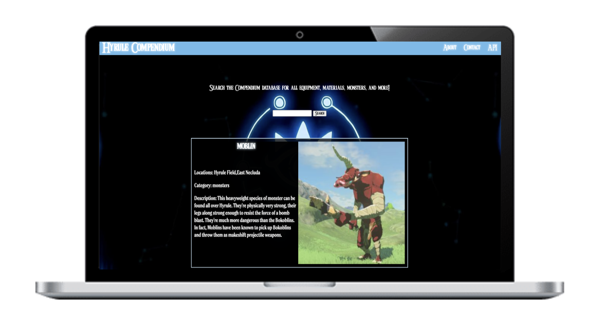
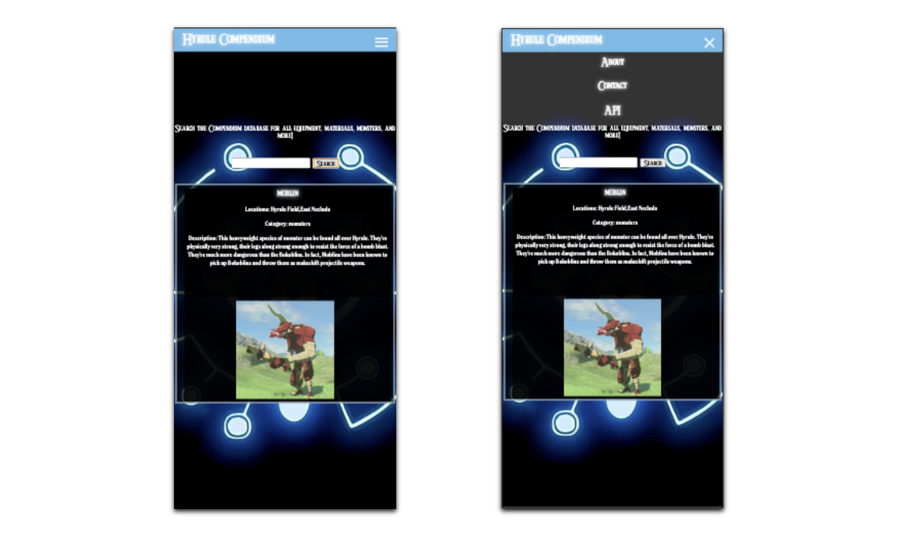

# Hyrule Compendium



## About

The Hryule Compendium is a comprehensive database containing materials, monsters, equipment, images, and locations from <em>Zelda: Breath of the Wild</em>.

This site pulls from the <a href="https://botw-compendium.herokuapp.com/api">Hyrule Compendium API</a>.

## Directions

Simply enter the name of an item and it will appear on the screen!

<strong>Note</strong>: <em>Zelda: Tears of the Kingdom</em> items are not available yet within the API; it's a WIP! Be sure to enter an item from BOTW.

## Behind the Screens (Get it?)



An interesting new skill I learned was how to transform the navigation menu when looking at a smaller screen. With the help of YouTube and MDN, I was able to figure out how to make the navigation menu turn into a "hamburger menu" on a smaller screen.

Below is the HTML, CSS, and Javascript used to achieve this:

### HTML
```
<header>
    <nav class="nav_bar">
        <h1>Hyrule Compendium</h1> 
            <a href="#" class="nav_hamburger">
                <span class="nav_line"></span>
                <span class="nav_line"></span>
                <span class="nav_line"></span>
            </a>

        <div class="nav_menu">
            <ul class="navigation">
                <li class="nav_link" id="about"><a href="#">About</a></li>
                <li class="nav_link" id="contact"><a href="#">Contact</a></li>
                <li class="nav_link" id="categories"><a href="#">API</a></li>
        </ul>
        </div>
    </nav>
    </header>
```

### CSS
```
.nav_bar {
    height: 40px;
    display: flex;
    justify-content: space-between;
    align-items: center;
    background-color: #6ebbea;
    padding-bottom: 5px;
}

.nav_hamburger {
    width: 25px;
    height: 22px;
    display: none;
    flex-direction: column;
    justify-content: space-around;
    position: absolute;
    top: 16px;
    right: 16px;
}

.nav_line {
    height: 3px;
    width: 100%;
    background-color: white;
    border-radius: 10px;
    transition: all ease-in-out 0.2s;
}

@media (min-width: 400px) and (max-width: 767px) {
    h1 {
        font-size: 25px;
    }

    .descrip {
        padding-top: 145px;
        font-size: 17px;
    }

    .nav_hamburger {
        display: flex;
    }

    .nav_menu {
        position: absolute;
        display: flex;
        align-items: center;
        background-color: rgba(255, 255, 255, 0.2);
        top: -208px;
        width: 100%;
        transition: all ease-in-out 0.4s;
    }

    .nav_bar {
        flex-direction: column;
        align-items: flex-start;
    }
    
    .nav_menu ul {
        flex-direction: column;
        width: 100%;
        padding: 40px 0 9.2px;
    }

    .nav_menu ul li {
        text-align: center;
        font-size: 20px;
    }

    .nav_menu {
        z-index: -1;
    }

    .nav_menu.active {
        top: 0;
    }

    .nav_hamburger.active :nth-child(1) {
        transform: rotate(45deg) translate(7.2px, 3px);
    }

    
    .nav_hamburger.active :nth-child(2) {
        opacity: 0;
    }

    .nav_hamburger.active :nth-child(3) {
        transform: rotate(-45deg) translate(7.2px, -3px);
    }
```

### JavaScript
```
const navHamburger = document.querySelector(".nav_hamburger")
const linksContainer = document.querySelector(".nav_menu")
const links = document.querySelectorAll(".nav_link")

navHamburger.addEventListener("click", () => {
    linksContainer.classList.toggle("active");
    navHamburger.classList.toggle("active");
    });

        window.addEventListener("resize", () => {
            if (window.matchMedia("(max-width: 400px)").matches) {
                closeMenu();
            }
        });

        if (window.matchMedia("(max-width: 400px)").matches) {
            closeMenu();
        }

        function closeMenu() {
            links.forEach((link) => {
                link.addEventListener("click", () => {
                    linksContainer.classList.remove("active");
                    navHamburger.classList.remove("active");
                });
            });
        }
```
### Additional Links

<h4>Resources<h4>
<ul>
    <li><a href="https://www.youtube.com/watch?v=G4LYPf8isVg">YouTube: Nav Hamburger Menu</a>
    <li><a href="https://developer.mozilla.org/en-US/docs/Learn/CSS/CSS_layout/Responsive_Design">MDN: Responsive Design</a></li>
</ul>
